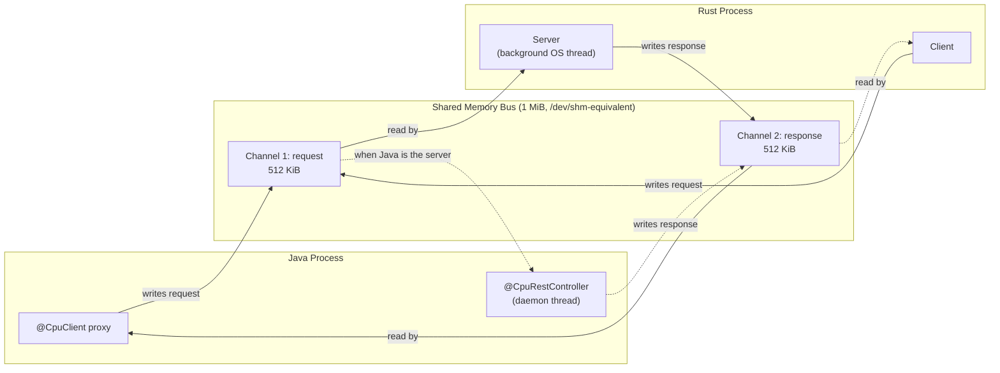

# cpurest: HTTP/REST Ergonomics at Shared-Memory Speed

*A polyglot IPC framework for co-located Rust and Java services.*

## 1. Problem

Microservice teams increasingly split a single physical host into multiple processes anyway — a Rust data-plane service next to a Java control-plane service, for example — because different languages suit different parts of the problem. The default way to connect them is HTTP over loopback TCP. That gets you REST's ergonomics (typed routes, JSON bodies, a request/response mental model everyone already knows) but it also gets you a full TCP/IP stack, kernel socket buffers, and JSON-over-sockets serialization for a call that never leaves the machine. Measured round trips for this pattern typically land in the 5–15ms range once you include connection handling and (de)serialization overhead — fine for a call across a datacenter, wasteful for a call across a process boundary on the same box.

The alternative most teams reach for instead — raw FFI (JNI, a C ABI) — removes the network stack but reintroduces the problems HTTP was hiding: no request/response framing, no error isolation (a panic or a bad pointer can take down the *host* process, not just the call), and no type safety at the boundary. It's fast and it's dangerous, and it doesn't feel like calling a service — it feels like calling into your own memory space, because it is your own memory space.

cpurest's premise: same-host IPC doesn't have to choose between "safe but slow" and "fast but dangerous." POSIX shared memory gives two independent processes a shared byte range without a network stack in between; a small, fixed protocol on top of that byte range can give it REST's ergonomics without paying for REST's transport.

## 2. Architecture



A **bus** is one named 1 MiB `shm_open` segment, created by whichever side calls `.server(...)` / `Server::bind(...)`. Roles are relative to the creator, not to language: Channel 1 always carries client → server requests, Channel 2 always carries server → client responses. This is what lets the identical `Bus` type serve a Rust-hosts-the-route bus (`/tax_engine` in the example project) and a Java-hosts-the-route bus (`/java_backend`) with the same code path on both sides.

Each channel is a **single-slot SPSC mailbox**, not a multi-slot ring — see §6 for why that's a deliberate scope decision, not an oversight.

## 3. Wire Protocol

Each channel's header is 3 cache lines (192 bytes), not a literal 64-byte struct — the state flag is the only field either side polls, so it gets an entire cache line to itself to avoid false-sharing with the cold fields:

| Offset | Size | Field | Notes |
|---|---|---|---|
| 0 | 4B | `state_flag` (u32, atomic) | `0=IDLE`, `1=REQ_READY`, `2=RESP_READY`. Alone on cache line 0. |
| 64 | 1B | `method` (u8) | `0=GET 1=POST 2=PUT 3=DELETE` |
| 66 | 2B | `status` (u16) | HTTP-style status (200/400/404/500/...) |
| 68 | 4B | `payload_len` (u32) | |
| 128 | 64B | `route` | Null-terminated UTF-8, e.g. `/calculate` |
| 192 | up to 524,096B | payload | JSON body |

Multi-byte fields are **native-endian** — both endpoints run on the same physical host by construction, so there's no reason to pay for byte-swapping, at the cost of the format not being portable to a byte-swapped pair of machines (out of scope for host-local shared memory).

JSON field names are standardized on **`snake_case`** on the wire. Rust's `serde` serializes struct fields as-written (`tax_owed`); Java convention is camelCase (`taxOwed`). On the Rust side that needs nothing extra — the struct field *is* the wire name. On the Java side, `cpurest-java` uses `json-serializer` (see §6) rather than Jackson: there's no automatic naming-strategy layer to configure globally, so each DTO's `JsonCodec` simply spells the wire name explicitly — either directly (`JsonField.of("tax_owed")` in a hand-written codec) or via `@JsonName("tax_owed")` on the record component if it's `@JsonRecord`-generated — one line per field either way, in the one place that already has to know both names.

**Sync primitive**: the *writer* claims a slot transition with a real atomic CAS (`compare_exchange`/`compareAndSet` `IDLE → READY`). The *reader* spin-waits via plain acquire-loads — a tight busy-spin for roughly the first 500ns (the common case: the peer is usually already done or about to be), escalating to cooperative yielding, then to short parked sleeps if the peer is slow — so an idle bus doesn't peg a core at 100%.

## 4. API Surface

**Rust** (`cpurest` crate, routing via attribute macros collected at compile time through `inventory`):

```rust
use cpurest::{cpu_post, CpuError, Json, Server};

#[cpu_post("/calculate")]
async fn calculate(Json(req): Json<TaxRequest>) -> Result<Json<TaxResponse>, CpuError> {
    Ok(Json(TaxResponse { tax_owed: req.income * 0.2, effective_rate: 0.2 }))
}

let handle = Server::bind("/tax_engine")?.serve();
```

```rust
let client = Client::connect("/tax_engine")?;
let resp: TaxResponse = client.post("/calculate", &req).await?;
```

**Java** (`cpurest-java`, Java 22's `java.lang.foreign` Foreign Function & Memory API):

```java
@CpuClient(bus = "/tax_engine")
interface TaxClient {
    @CpuPost("/calculate")
    TaxResponse calculate(TaxRequest request);
}
TaxClient client = CpuRest.client(TaxClient.class);
```

```java
@CpuRestController(bus = "/java_backend")
class ValidationController {
    @CpuPost("/validate")
    public ValidateResponse validate(ValidateRequest req) { ... }
}
CpuServer server = CpuRest.server().register(new ValidationController()).start();
```

`TaxRequest`/`TaxResponse`/`ValidateRequest`/`ValidateResponse` above are public records, each exposing a `public static final json.JsonCodec<T> CODEC` — either hand-written, or (as `TaxRequest`/`TaxResponse` actually do) generated at compile time by annotating the record `@json.JsonRecord`, which produces the identical code a human would write, not a reflective auto-mapping (see §6's note on code generation). `examples/java/java-backend-demo`'s DTOs are the worked example of both styles side by side.

Both sides catch failures at the boundary rather than letting them cross it: Rust wraps every handler invocation in `catch_unwind`, mapping a panic to a 500 JSON body; Java's server dispatcher does the equivalent around reflective invocation, so a bug in one route can't take the host process down or wedge the bus for other routes.

## 5. Measured Performance

Both directions below are 200-warmup + 2,000-timed-call benchmarks, single-threaded, synchronous, on the machine this was built on (Apple Silicon, macOS), run back to back in the same session so they're a fair comparison. Reproduce with `scripts/run-demo.sh` (Rust-as-server direction) and `examples/rust/target/release/validate_client` against a `java -jar java-backend-demo.jar --serve` (Java-as-server direction).

| Direction | min | p50 | mean | p99 |
|---|---|---|---|---|
| Java client → Rust server (`POST /tax_engine/calculate`) | 7.1µs | 11.3µs | 14.9µs | 81.5µs |
| Rust client → Java server (`POST /java_backend/validate`) | 4.4µs | 7.2µs | 16.6µs | 74.3µs |

That's roughly **300–1300× faster** than the 5–15ms HTTP-over-loopback baseline this project set out to beat, measured, not estimated, **in both directions** — the two dispatch mechanisms (a direct function-pointer call through Rust's `inventory`-built route table vs. `java.lang.reflect.Method.invoke` on the Java side) land in the same order of magnitude once JSON stopped being the bottleneck (see below). The p99 tail on both sides is scheduler/JIT noise (GC pauses, thread scheduling jitter) rather than anything protocol-specific — the tight spin phase means the *protocol's* own contribution to latency is close to the min/p50 numbers.

This is not a claim that cpurest is faster than raw FFI (it isn't, and doesn't try to be) — it's a claim that it's fast enough to make "just use HTTP for simplicity" a bad trade for same-host calls.

**Why the Java-as-server direction used to be the slow one, and isn't anymore.** An earlier version of `cpurest-java` used Jackson's `ObjectMapper` for JSON, and Java-as-server settled at a steady-state of ~450–550µs — 15–20× faster than HTTP, but a clear step behind the Rust-as-server direction (which never touched Jackson at all; Rust's `serde_json` isn't reflection-based). Switching to `json-serializer` — a no-reflection JSON library built around one small `JsonCodec<T>` per DTO type, hand-written or generated at compile time (see §6's note on code generation), never reflective at runtime (see `com.cpurest.util.Wire` for how cpurest bridges its unavoidably-reflective *route* dispatch to json-serializer's reflection-free *field* access) — removed the actual bottleneck: reflective field-by-field (de)serialization on every call, not `Method.invoke` itself. The table above is measured after that switch. The first call to a given route still costs Java an extra ~2–4.5ms one-time — JVM bytecode-to-`MethodAccessor` reflection inflation and JIT tiering for `Method.invoke` specifically, which the 200-call warmup phase exists to absorb — but steady state no longer has a JSON tax on top of it. The Java-client-to-Rust-server direction improved too (compare this table to the original 9–46µs range from before the switch), for the same reason from the other side: Jackson was cpurest-java's *one* shared codec regardless of role, so every Java-side encode/decode paid its reflection cost whether Java was the client encoding a request or the server encoding a response. Removing it sped up both roles, not just the one that happened to headline the earlier "Java-as-server is slower" finding.

**Isolated, controlled confirmation** (not just inferred from end-to-end system noise): the same process, same JVM run, encoding/decoding the same payloads back to back with Jackson's `ObjectMapper` and json-serializer's hand-written codecs, no shared memory or reflection dispatch involved — purely the JSON step in isolation, JDK 22, Apple Silicon, warmup then best-of-5-runs-of-1M-iterations (methodology matches json-serializer's own `Bench.java`):

| Payload | Op | Jackson | json-serializer | Speedup |
|---|---|---|---|---|
| `TaxResponse` (cpurest's actual shape, 2 doubles) | encode | 280.4 ns/op | 200.4 ns/op | 1.4× |
| | decode | 301.6 ns/op | 131.0 ns/op | 2.3× |
| `User` (json-serializer's own published benchmark shape: 7 fields, array, nested object) | encode | 399.3 ns/op | 202.6 ns/op | 2.0× |
| | decode | 587.4 ns/op | 313.3 ns/op | 1.9× |

The `User` row lands close to json-serializer's own README numbers (168/265 ns/op) on different machine state — same order of magnitude, a useful independent cross-check that the library's own published claim holds up outside its own benchmark harness.

## 6. Engineering Notes

**Why single-slot channels, not a multi-slot ring.** Every usage pattern in scope is synchronous request/response (`client.post(...).await`), with no pipelining requirement. A single-slot ping-pong buffer (`IDLE → READY → consumed → IDLE`) is what a lock-free ring degenerates to for one producer/one consumer with no in-flight overlap, and is far simpler to get correct than a true multi-slot MPMC ring (sequence numbers, wraparound, producer/consumer cursors). It's named `RingChannel` on both sides for parity with the spec's vocabulary and to leave room for the pipelined version described in `docs/PRD.md`'s roadmap.

**Compile-time code generation, not reflection, for less DTO boilerplate.** `json-serializer`'s no-reflection design means every DTO needs a hand-written `write`/`read` pair — real boilerplate for a type with several fields. Rather than accept that trade or reach for a reflective auto-mapper (reintroducing the exact cost `json-serializer` exists to avoid), it ships a `javac` annotation processor: `@JsonRecord` on a record generates a `<Type>Codec` class, structurally identical to what a human would write, at compile time only — the annotation itself is `@Retention(SOURCE)` and never reaches a `.class` file, and the generated code has no more reflection in it than a hand-written codec does. `Wire` looks for the generated `<Type>Codec.CODEC` as a fallback after a direct `CODEC` field, since a standard annotation processor can only emit new files, never inject a field into the type it was triggered by. Measured: `TaxRequest`/`TaxResponse` (using `@JsonRecord`) and `ValidateRequest`/`ValidateResponse` (hand-written) produce identical round-trip latency in the demo — 5.6/11.4/16.1/86.9µs vs. the hand-written baseline's 7.1/11.3/14.9/81.5µs, the same noise band, not a regression. One real Maven-specific gotcha: implicit annotation-processor discovery from the plain compile classpath is unreliable under Maven's default in-process compilation, so any Maven consumer needs an explicit `<annotationProcessorPaths>` entry (see `examples/java/java-backend-demo/pom.xml`) — a long-standing Maven quirk, not something specific to this processor (Lombok, MapStruct, and Dagger all document the identical workaround).

**The variadic-call bug.** The single hardest bug in this project had nothing to do with shared memory, lock-freedom, or JSON — it was calling `shm_open` from Java. POSIX declares it `int shm_open(const char *name, int oflag, ...)` — genuinely variadic, because `mode` only matters with `O_CREAT`. Every straightforward FFM downcall declaration for it (a fixed-arity 3-parameter `FunctionDescriptor`, matching how virtually every FFM shm_open example is written) passes `mode` through the *wrong part of Apple's arm64 calling convention*: Apple's ABI requires variadic arguments to go on the stack, while a fixed-arity downcall passes them in registers per standard AAPCS64. The callee — genuinely compiled as variadic — reads garbage off the stack instead of the real value. The result: the creating process gets a working fd (POSIX doesn't re-check permissions on the fd that just created the file), so nothing looks wrong locally — but the *stored file mode* is corrupted (`0666` became something like `0340`, i.e. `-wx-r-----`), so **every other process's later `shm_open()` fails with `EACCES`**. Rust's `libc` crate was unaffected throughout, because it declares `shm_open` as truly variadic in its own binding. The fix is one line: `Linker.Option.firstVariadicArg(2)` on the downcall. Verified by inspecting the resulting file's mode directly before/after the fix (`0340` → `0644` on a matching regular-file test). See `Libc.java`'s `SHM_OPEN` field for the full writeup in code, since this is exactly the kind of bug that will resurface for anyone else building FFM bindings to `shm_open`, `open`, or any other POSIX varargs function.

## 7. Known Limitations

See `docs/PRD.md`'s Known Limitations section for the full, current list (fixed bus size, one in-flight request per bus, no transport-level auth, etc.) and the roadmap for addressing them.
